<div align="center">
  


```
 █████╗ ███████╗████████╗ █████╗ ██████╗ 
██╔══██╗██╔════╝╚══██╔══╝██╔══██╗██╔══██╗
███████║█████╗     ██║   ███████║██████╔╝
██╔══██║██╔══╝     ██║   ██╔══██║██╔══██╗
██║  ██║██║        ██║   ██║  ██║██████╔╝
╚═╝  ╚═╝╚═╝        ╚═╝   ╚═╝  ╚═╝╚═════╝ 

██████╗  ██╗  ██╗  █████╗  ██████╗   ██████╗   █████╗   ██████╗  ███╗   ██╗ ██╗  ██╗  █████╗  ██████╗ 
██╔══██╗ ██║  ██║ ██╔══██╗ ██╔══██╗ ██╔════╝  ██╔══██╗ ██╔═══██╗ ████╗  ██║ ██║ ██╔╝ ██╔══██╗ ██╔══██╗
██████╔╝ ███████║ ███████║ ██║  ██║ ██║  ███╗ ███████║ ██║   ██║ ██╔██╗ ██║ █████╔╝  ███████║ ██████╔╝
██╔══██╗ ██╔══██║ ██╔══██║ ██║  ██║ ██║   ██║ ██╔══██║ ██║   ██║ ██║╚██╗██║ ██╔═██╗  ██╔══██║ ██╔══██╗
██████╔╝ ██║  ██║ ██║  ██║ ██████╔╝ ╚██████╔╝ ██║  ██║ ╚██████╔╝ ██║ ╚████║ ██║  ██╗ ██║  ██║ ██║  ██║
╚═════╝  ╚═╝  ╚═╝ ╚═╝  ╚═╝ ╚═════╝   ╚═════╝  ╚═╝  ╚═╝  ╚═════╝  ╚═╝  ╚═══╝ ╚═╝  ╚═╝ ╚═╝  ╚═╝ ╚═╝  ╚═╝
```

### `< Web Developer · Software Engineer · Photographer >`


</div>




<br clear="right"/>

---


**Languages**


**Web Technology Stack**


**Database**


**DevOps & OS**


**Developer Tools**


**UI/UX Tools**


---

<div align="center">


</div>

---

<div align="center">

[](https://www.linkedin.com/in/aftab-bhadgaonkar/)
&nbsp;
[](mailto:the.aftab23@email.com)
&nbsp;
[](https://github.com/AftabIB)
&nbsp;
[](https://leetcode.com/u/Aftab_B/)


</div>

<div align="center">
  

  
</div>
